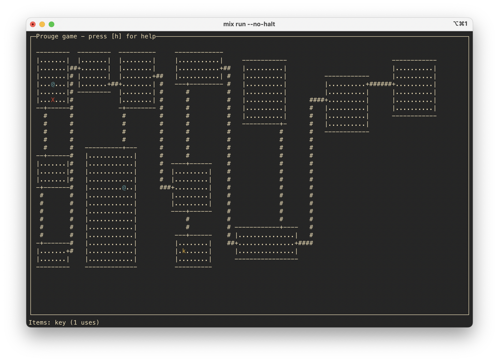
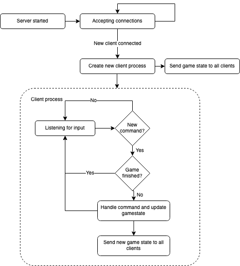

# Prouge

A simple networked rougelike with server and client written in Elixir. Contains `prouge_client` and `prouge_server`. To run the game, you will need to have one server instance running and connect any number of clients.



## How to run

You will need to have Elixir installed on your computer, refer to https://elixir-lang.org/install.html for information on how to install.

### Server

Make sure that you are in the `prouge_server` directory. Defaults to using port 3000, if you want to use something else,
set `PROUGE_PORT` to some other value.

```
mix deps.get
mix run --no-halt
```

### Client

Make sure that you are in the `prouge_client` directory. Defaults to using port 3000 and host 127.0.0.1 (localhost), if you want to use something else, set `PROUGE_PORT` and/or `PROUGE_HOST` to some other value.

```
mix deps.get
mix run --no-halt
```

## The game

The game can be played with any number of players whose goal is to find and unlock the chest (marked with an X on the map). Each player must find and pick up a key (marked with a k) and go to the chest, since a single player can only carry one key. The chest needs to be unlocked by every player in the game in order to win. A player can only see rooms on the map that they have previously entered.

### Server

The server works by running multiple processes: One TCP server process, one game process and multiple client processes. The TCP server accepts TCP connections from clients, starts a client process (responsible for communicating with a single client) and hands over the connection to that newly created process. The game process holds and updates the game state. Whenever the game state is updated by a client, the new game state is sent to all connected clients.

### Client

The client uses the [Ratatouille](https://github.com/ndreynolds/ratatouille) library for displaying the game inside a terminal. It has a TCP client process that communicates (recieves the game state and sends commands) with the game server.

### State diagram


### Generating the map

One of the more ambitious parts of this project is the random map generation. Each time the server is started a new map is generated using BSP, [Binary Space Partitioning](https://en.wikipedia.org/wiki/Binary_space_partitioning). The map is randomly split either vertically or horizontally, and then the smaller sections are again divided in the same way. The rectangles are stored in a tree structure. In each small rectangle (the leaves of the tree) a room is placed. We then put tunnels between the rooms in each parent node. If the split was vertical we the room furthest to the right in the left rectangle and connect it to the room furthest to the left in the right rectangle and if the split was horizontal we take the lowest room of the top rectangle and connect it to the highest room in the bottom rectangle.

## Protocol

The application uses TCP sockets. Each message is prefixed with 4 bytes containing the length of the bytes in the message to be read, in big-endian format. The rest of the bytes in the message are UTF-8 encoded JSON data.

### Game state

The server sends only one type of data: the gamestate. A gamestate JSON object looks like the following:

```json
{
  "players": [
    // x and y coordinates of each player
    { "x": 78, "y": 3 },
    { "x": 72, "y": 27 }
  ],
  "map": {
    // game map
    "h_tunnels": [
      // horizontal tunnels
      { "x1": 83, "x2": 86, "y": 3 },
      { "x1": 86, "x2": 90, "y": 25 }
    ],
    "height": 30, // map height
    "items": [{ "type": "key", "x": 76, "y": 13 }], // Items on map
    "rooms": [
      // Rooms on the map
      {
        "x1": 90,
        "x2": 104,
        "y1": 23,
        "y2": 27,
        "doors": [
          // Doors from room to tunnels
          { "x": 90, "y": 25 },
          { "x": 93, "y": 23 }
        ]
      },
      {
        "x1": 90,
        "x2": 100,
        "y1": 2,
        "y2": 19,
        "doors": [{ "x": 93, "y": 19 }]
      },
      {
        "x1": 68,
        "x2": 82,
        "y1": 22,
        "y2": 28,
        "doors": [
          { "x": 68, "y": 25 },
          { "x": 71, "y": 22 }
        ]
      },
      {
        "x1": 69,
        "x2": 78,
        "y1": 8,
        "y2": 16,
        "doors": [
          { "x": 75, "y": 8 },
          { "x": 71, "y": 16 }
        ]
      },
      {
        "x1": 70,
        "x2": 83,
        "y1": 1,
        "y2": 5,
        "doors": [
          { "x": 75, "y": 5 },
          { "x": 83, "y": 3 }
        ]
      }
    ],
    "v_tunnels": [
      // Vertical tunnels
      { "x": 93, "y1": 19, "y2": 23 },
      { "x": 86, "y1": 3, "y2": 25 },
      { "x": 71, "y1": 16, "y2": 22 },
      { "x": 75, "y1": 5, "y2": 8 }
    ],
    "width": 110 // Width of the map
  },
  "state": "playing", // State, can be either "playing" or "finished"
  "items": [{ "type": "key", "uses": 1 }] // Items in the player inventory, uses is decreased after using it.
}
```

In this above example, this message would be prefixed with the 4 bytes 0x00, 0x00, 0x02, and 0xc6 since the JSON data is 0x2c6 (710) bytes long (after removing whitespace and comments). Note that this number is represented in big-endian format.

### Commands

The client sends commands to the server in a similar manner, each message that will be sent needs to be prefixed with 4 bytes containing the message length (excluding the first 4 bytes) in big-endian format. Commands are also formatted as UTF-8 encoded JSON. The server only accepts one type of command: `"move"`. A move command looks like the following:

```json
{
  "command": { "move": "right" }
}
```
The following move direction values are accepted: `"left"`, `"right"`, `"up"` and `"down"`. In this example, this message would be prefixed with the 4 bytes 0x00, 0x00, 0x00, and 0x1c since the JSON data is 0x1c (28) bytes long (after removing whitespace and newlines). Note that this number is represented in big-endian format.